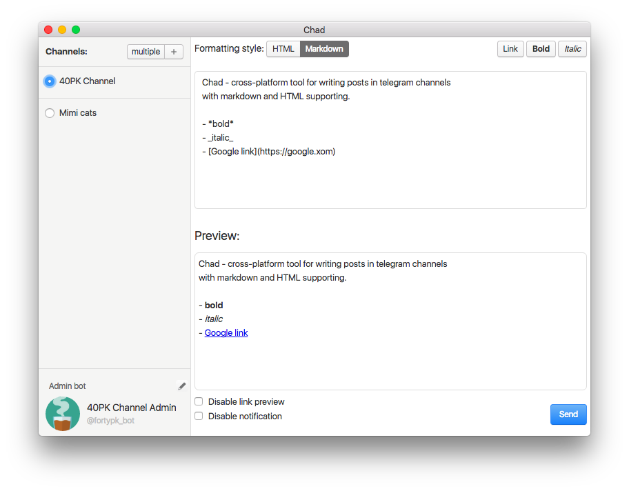
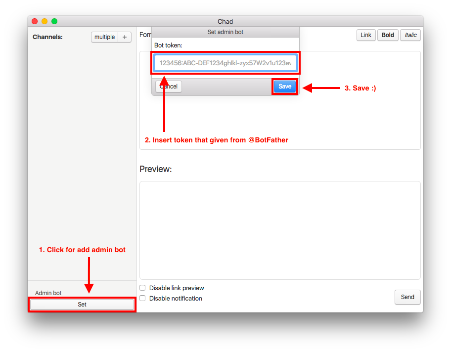
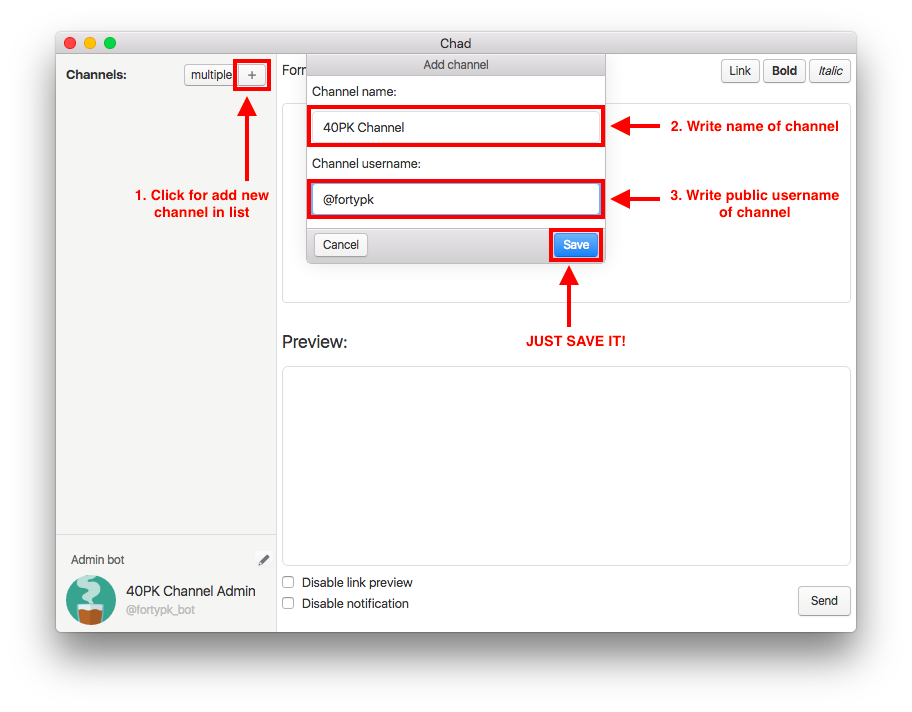
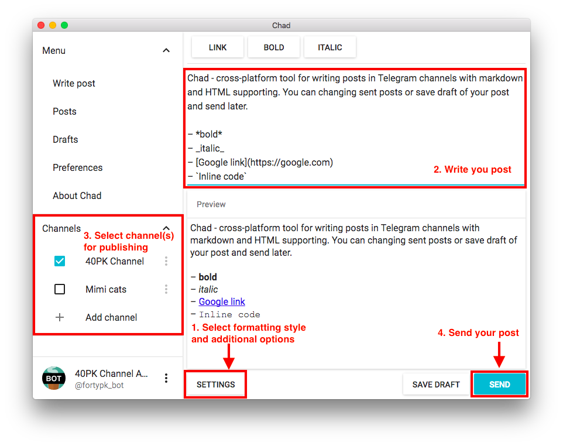

# Chad

Cross-platform tool for writing posts in telegram channels with markdown and HTML supporting.




## Features
---
- Post preview (HTML, markdown, plain text)
- Sending posts in multiple channels
- Formatting constrols (link, bold, italic)
- OS X design 😊

## How to use
---
If you have own bot token in telegram, you can start from step 4
1. Goto `@BotFather` in telegram
2. Create new bot with `/newbot` command
3. `@BotFather` give you bot `token` (`'123456:ABC-DEF1234ghIkl-zyx57W2v1u123ew11'`)
4. Setting up bot, that will send posts in channel 
5. Add channels where the posts will be sent 
6. Write your post and send 

## Roadmap
---
- Drafts
- Change published posts
- Attachments
- Link preview
- Telegram-style preview
- Sync scroll
- Two-column writing design

## Used libraries and frameworks
---
- [Electron](http://electron.atom.io/) - framework for create cross-platform desktop applications using JavaScript, HTML and CSS
- [Angular.js](https://angularjs.org) - JavaScript MVW Framework
- [jQuery](https://jquery.com/) - JavaScript DOM manipulation library
- [XSS](https://www.npmjs.com/package/xss) - HTML sanitizer
- [electron-contextmenu-middleware](https://github.com/parro-it/electron-contextmenu-middleware) - `Electron` context menu
- [electron-input-menu](https://www.npmjs.com/package/electron-input-menu) - Context menu for `Electron` input elements

## How to build
---
1. Install `electron-packager`:
```
npm install electron-packager -g
```
2. Install dependencies:
```
npm install
```
3. Run build script from terminal
```
# OS X
npm run package-darwin
# Linux
npm run package-linux
# Windows
npm run package-win
```
Builds destionation folder - `'builds'`