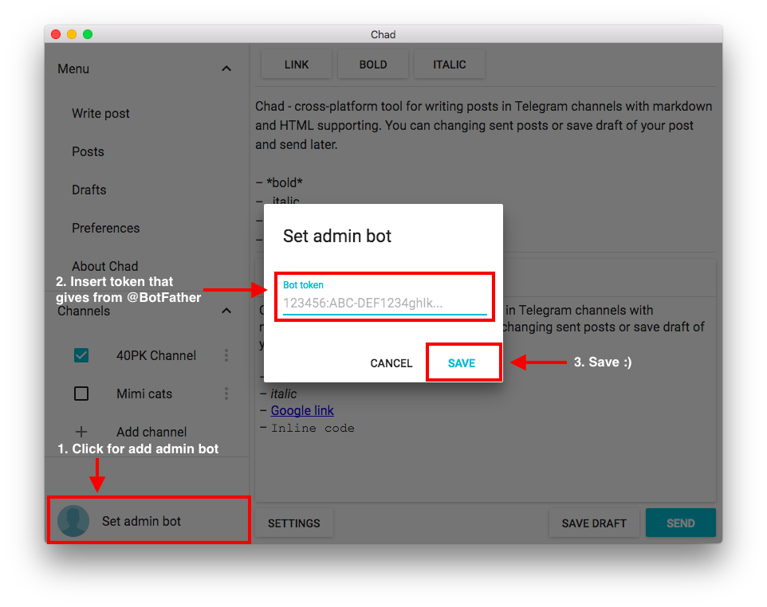
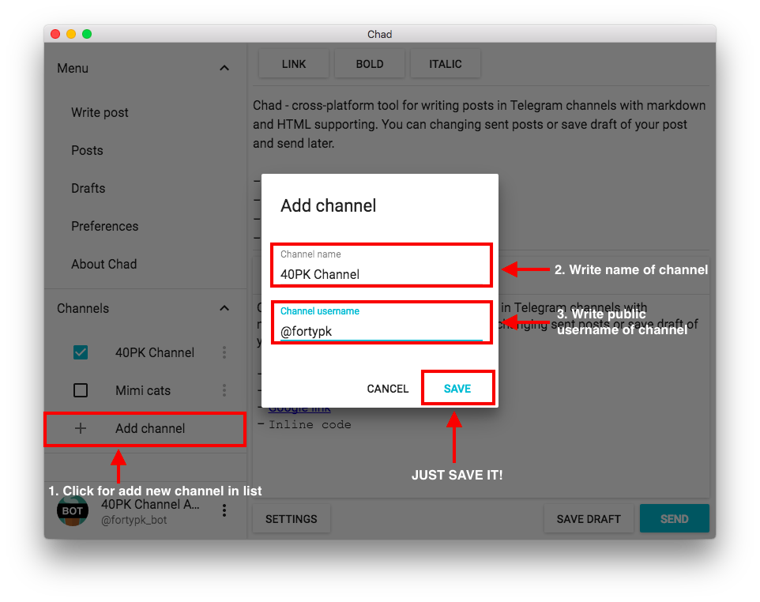

# Chad

Cross-platform tool for writing posts in telegram channels with markdown and HTML supporting.

[Download](https://github.com/Perkovec/Chad/releases) - [Changelog](https://github.com/Perkovec/Chad/blob/master/CHANGELOG.md) - [Features](#features) - [How to use](#how-to-use) - [Roadmap](#roadmap) - [Used libraries](#used-libraries-and-frameworks) - [How to build](#how-to-build)


## Features
- Post preview (HTML, markdown, plain text)
- Sending posts in multiple channels
- Drafts of posts
- Change sent posts
- Sending post options
- Formatting controls (link, bold, italic)
- Multilanguage support
- Material design 😊

## How to use
If you have bot token in telegram, you can start from step 4

1. Goto `@BotFather` in telegram
2. Create new bot with `/newbot` command
3. `@BotFather` give you bot `token` (`'123456:ABC-DEF1234ghIkl-zyx57W2v1u123ew11'`)
4. Setting up bot, that will send posts in channel 
5. Add channels where the posts will be sent 
6. Write your post and send 

## Roadmap
- Attachments
- Link preview
- Telegram-style preview
- Sync scroll
- Two-column writing design
- Auto update
- Autosave
- Hotkeys and other user settings

## Used libraries and frameworks
- [Electron](http://electron.atom.io/) - framework for create cross-platform desktop applications using JavaScript, HTML and CSS
- [React](https://facebook.github.io/react/) - JavaScript library for building user interface
  - react-dom
- [Material-UI](http://www.material-ui.com) - A Set of React Components that Implement Google's Material Design
  - [react-tap-event-plugin](https://github.com/zilverline/react-tap-event-plugin) - Instant TapEvents for React
- [XSS](https://github.com/leizongmin/js-xss) - HTML sanitizer
- [electron-contextmenu-middleware](https://github.com/parro-it/electron-contextmenu-middleware) - `Electron` context menu
- [electron-input-menu](https://github.com/parro-it/electron-input-menu) - Context menu for `Electron` input elements
- [universal-analytics](https://github.com/peaksandpies/universal-analytics) - Module for Google's Universal Analytics tracking
- [react-layout-pane](https://github.com/tomkp/react-layout-pane) - React layout component using flexbox
- [superagent](https://github.com/visionmedia/superagent) - small progressive client-side HTTP request library

## How to build
1. Install `electron-packager` and `gulp`:
```
npm install electron-packager gulp -g
```
2. Install dependencies:
```
npm install
```
3. Compile code:
```
# Debug
gulp build-debug

# Relese
gulp build-relese
```
4. Run build script:
```
# OS X
npm run package-darwin

# Linux
npm run package-linux

# Windows
npm run package-win
```
Builds destionation folder - `'builds'`
